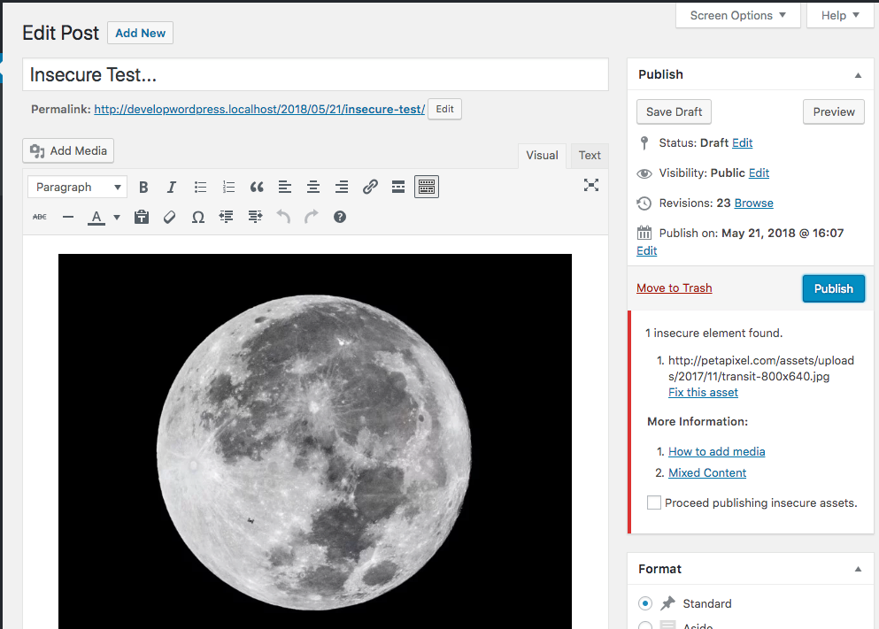
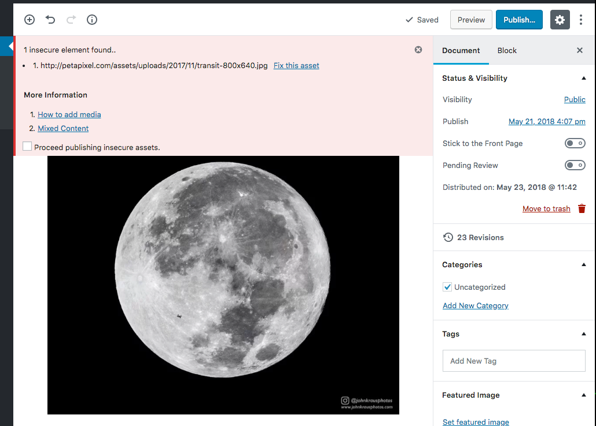

Insecure Content Warning
=============

Helps prevent mixed-content browser warnings by flagging elements (images, videos, embeds) in the editor sourced from insecure web addresses, before a post is published.

## Description

Insecure Content Warning helps content creators with secure (HTTPS) websites avoid insecure-content warnings in the browser by flagging any elements in the content editor (such as images and embeds) that are being delivered or sourced from an insecure (HTTP) web address. All insecure elements are flagged before the content is published, and can be fixed manually or simply by clicking "fix it."

Compatible with the "classic" editor as well as Gutenberg, the next generation WordPress editor. Gutenberg compatibility is considered "in beta", until Gutenberg itself becomes part of WordPress core.

## Requirements

* Requires PHP 5.3+.
* Requires WordPress 4.6+.
* Gutenberg support is in beta.
* Requires a secure / SSL (HTTPS) website, front and back end.

## Contributing

Want to help? Check out our [contributing guidelines](CONTRIBUTING.md) to get started.

## Install

1. Install the plugin via the plugin installer, either by searching for it or uploading a .zip file.
2. Activate the plugin.

## Plugin Usage

This plugin requires no configuration. Simply activate and the plugin will prevent posts with insecure elements from being published, as well as provide a banner with information on the offending assets.

## Changelog

* 1.0 - Initial release.

## License

This plugin is free software; you can redistribute it and/or modify it under the terms of the [GNU General Public License](http://www.gnu.org/licenses/gpl-2.0.html) as published by the Free Software Foundation; either version 2 of the License, or (at your option) any later version.
