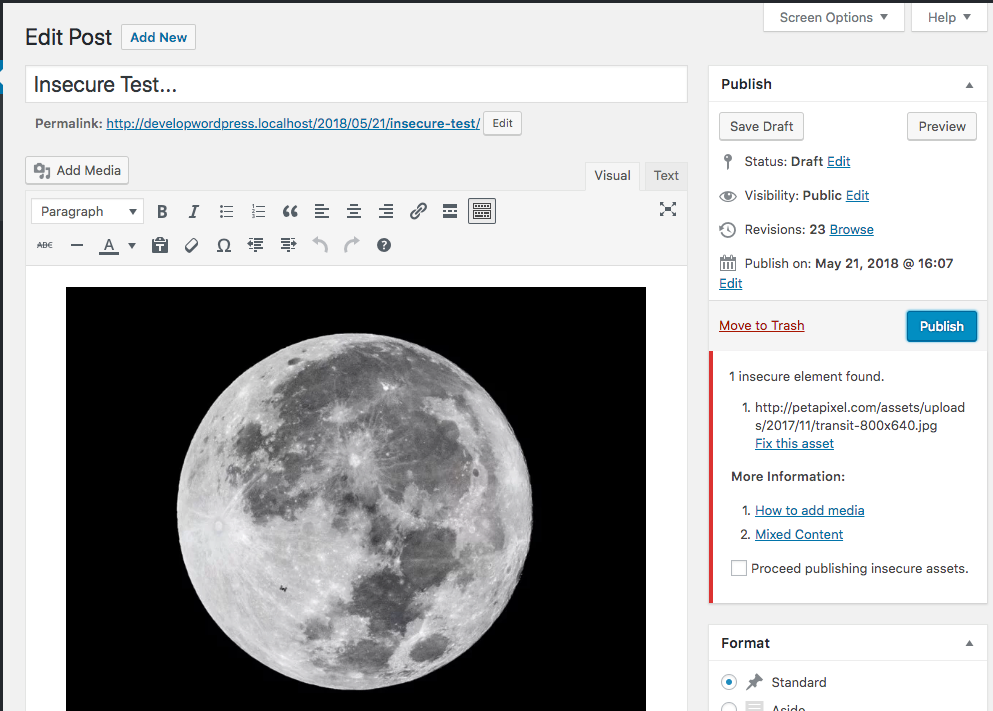
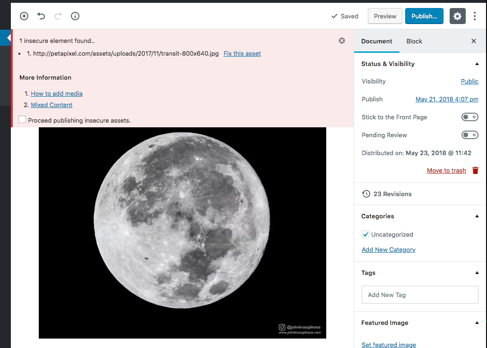

# Insecure Content Warning


[](#support-level)     [](https://github.com/10up/insecure-content-warning/blob/develop/LICENSE.md) [](https://github.com/10up/insecure-content-warning/actions/workflows/dependency-review.yml) [](https://github.com/10up/insecure-content-warning/actions/workflows/cypress.yml) [](https://github.com/10up/insecure-content-warning/actions/workflows/lint.yml) [](https://github.com/10up/insecure-content-warning/actions/workflows/php-compatibility.yml) [](https://github.com/10up/insecure-content-warning/actions/workflows/github-code-scanning/codeql) [](https://playground.wordpress.net/?blueprint-url=https://raw.githubusercontent.com/10up/insecure-content-warning/develop/.wordpress-org/blueprints/blueprint.json)

> Prevent editors from adding insecure content in the editor.

## Description

Insecure Content Warning helps content creators with secure (HTTPS) websites avoid insecure-content warnings in the browser by flagging any elements in the editor (such as images and embeds) that are being delivered or sourced from an insecure (HTTP) web address. All insecure elements are flagged before the content is published, and can be fixed manually or simply by clicking "fix it."

Compatible with both the block and classic editors.



## Requirements

* PHP 7.4+.
* WordPress 6.9+.
* A secure / SSL (HTTPS) website, front and back end.

## Installation

1. Install the plugin via the plugin installer, either by searching for it or uploading a .zip file.
2. Activate the plugin.

## Usage

This plugin requires no configuration. Simply activate and the plugin will prevent posts with insecure elements from being published, as well as provide a banner with information on the offending assets.



### Optional WP-CLI Commands

These are not required for normal usage of the plugin, but are available as a utility for more advanced usage.

#### wp icw fix

Used to fix insecure elements in existing content. Can target specific posts or bulk batches.

`wp icw fix [<id>] [--include] [--all] [--post_type] [--limit] [--offset] [--dry-run]`

**Example:**
Fix all page content:
 ```
 $ wp icw fix --all --post_type=page
 Checking post content...
 Total posts checked for insecure URL(s): 10
 +-------------------------------------+
 | URL(s) fixed summary                |
 +-------------------------------------+
 | 0/0 URL(s) fixed in post 98         |
 | 0/0 URL(s) fixed in post 96         |
 | 0/0 URL(s) fixed in post 76         |
 | ...........................         |
 | 0/0 URL(s) fixed in post 6          |
 | 0/0 URL(s) fixed in post 1          |
 +-------------------------------------+
 ```

Run `wp help icw fix` for more information.

## Frequently Asked Questions

### Where do I report security bugs found in this plugin?

Please report security bugs found in the source code of the Insecure Content Warning plugin through the [Patchstack Vulnerability Disclosure  Program](https://patchstack.com/database/vdp/ce5b1b34-7097-4f7b-9ab0-f96ee3dd9409).  The Patchstack team will assist you with verification, CVE assignment, and notify the developers of this plugin.

## Support Level

**Stable:** 10up is not planning to develop any new features for this, but will still respond to bug reports and security concerns. We welcome PRs, but any that include new features should be small and easy to integrate and should not include breaking changes. We otherwise intend to keep this tested up to the most recent version of WordPress.

## Changelog

A complete listing of all notable changes to Insecure Content Warning are documented in [CHANGELOG.md](https://github.com/10up/insecure-content-warning/blob/develop/CHANGELOG.md).

## Contributing

Please read [CODE_OF_CONDUCT.md](https://github.com/10up/insecure-content-warning/blob/develop/CODE_OF_CONDUCT.md) for details on our code of conduct, [CONTRIBUTING.md](https://github.com/10up/insecure-content-warning/blob/develop/CONTRIBUTING.md) for details on the process for submitting pull requests to us, and [CREDITS.md](https://github.com/10up/insecure-content-warning/blob/develop/CREDITS.md) for a listing of maintainers of, contributors to, and libraries used by Insecure Content Warning.

## Like what you see?

<a href="http://10up.com/contact/"></a>
