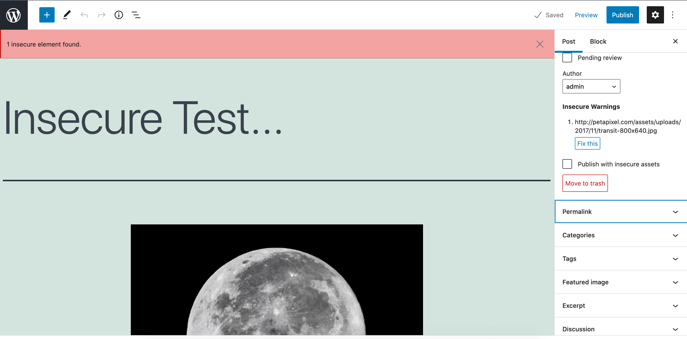

# Insecure Content Warning

> Prevent editors from adding insecure content in the editor. 

   

## Description

Insecure Content Warning helps content creators with secure (HTTPS) websites avoid insecure-content warnings in the browser by flagging any elements in the editor (such as images and embeds) that are being delivered or sourced from an insecure (HTTP) web address. All insecure elements are flagged before the content is published, and can be fixed manually or simply by clicking "fix it."

Compatible with both the block and classic editors.

## Requirements

* PHP 7.0+.
* WordPress 5.2+.
* A secure / SSL (HTTPS) website, front and back end.

## Installation

1. Install the plugin via the plugin installer, either by searching for it or uploading a .zip file.
2. Activate the plugin.

## Usage

This plugin requires no configuration. Simply activate and the plugin will prevent posts with insecure elements from being published, as well as provide a banner with information on the offending assets.

## Support Level

**Active:** 10up is actively working on this, and we expect to continue work for the foreseeable future including keeping tested up to the most recent version of WordPress.  Bug reports, feature requests, questions, and pull requests are welcome.

## Changelog

A complete listing of all notable changes to Insecure Content Warning are documented in [CHANGELOG.md](https://github.com/10up/insecure-content-warning/blob/develop/CHANGELOG.md).

## Contributing

Please read [CODE_OF_CONDUCT.md](https://github.com/10up/insecure-content-warning/blob/develop/CODE_OF_CONDUCT.md) for details on our code of conduct, [CONTRIBUTING.md](https://github.com/10up/insecure-content-warning/blob/develop/CONTRIBUTING.md) for details on the process for submitting pull requests to us, and [CREDITS.md](https://github.com/10up/insecure-content-warning/blob/develop/CREDITS.md) for a listing of maintainers of, contributors to, and libraries used by Insecure Content Warning.

## Like what you see?

